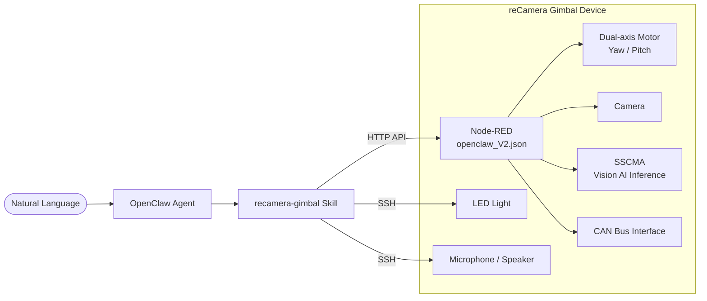

# reCamera Gimbal × OpenClaw

[简体中文](./README_zh.md) | **English**

Control the **reCamera Gimbal** edge AI camera with **[OpenClaw](https://github.com/anthropics/openclaw)** — use natural language to drive gimbal rotation, photo capture & recognition, LED lighting, audio recording & playback.

[](./LICENSE)

> [!IMPORTANT]
> This project is a **Skill extension** for the OpenClaw ecosystem and cannot run standalone.
>
> **Prerequisites:**
> - [OpenClaw](https://github.com/anthropics/openclaw) installed and running
> - reCamera Gimbal hardware (RISC-V based)
> - Device connected to local network with Node-RED running on port `:1880`
> - SSH access to the device (required for LED and audio control)
> - PowerShell (Windows) or Bash (Linux/macOS) environment

## How It Works



**Data Flow:**

1. User issues a natural language command to OpenClaw (e.g., "look around and tell me what you see")
2. OpenClaw matches the `recamera-gimbal` Skill and follows the operation guide defined in `SKILL.md`
3. Gimbal control and photo capture are handled via **HTTP API** calls to Node-RED flows
4. LED, audio recording, and playback are controlled via **SSH** directly on the device

## Features

| Feature | Description |
|---------|-------------|
| **Gimbal Control** | Dual-axis motor angle control — Yaw (1°–345°), Pitch (1°–175°) |
| **Visual Perception** | Capture photos and analyze scenes using a multimodal LLM |
| **Target Tracking** | Automatic target detection and gimbal tracking powered by SSCMA Vision AI |
| **LED Lighting** | Remote on/off control for the white fill light |
| **Audio Recording** | Record audio via onboard microphone for a configurable duration |
| **Audio Playback** | Play back recorded audio via onboard speaker |
| **CAN Bus** | CAN protocol communication (baud rate 1000000, interface can0) |
| **Web Dashboard** | Node-RED Dashboard UI with live preview, manual control, and device info pages |

## Quick Start

### 1. Import Node-RED Flows

Import `openclaw_V2.json` into the Node-RED instance running on your reCamera Gimbal:

1. Open `http://<DEVICE_IP>:1880`
2. Click the menu (top-right) → **Import** → paste or upload `openclaw_V2.json`
3. Click **Deploy**

The flow requires the following Node-RED modules (ensure they are installed):

| npm Module | Version | Purpose |
|------------|---------|---------|
| `@flowfuse/node-red-dashboard` | v1.26.0 | Web Dashboard UI |
| `node-red-contrib-seeed-canbus` | v0.0.7 | CAN bus communication |
| `node-red-contrib-sscma` | v0.3.5 | SSCMA Vision AI inference |
| `node-red-contrib-os` | v0.2.1 | System information |
| `node-red-contrib-seeed-recamera` | v0.0.8 | reCamera motor control |

### 2. Install the Skill

Copy the `recamera-gimbal/` directory into your OpenClaw Skills directory:

```bash
cp -r recamera-gimbal/ <OPENCLAW_WORKSPACE>/skills/recamera-gimbal
```

<!-- TODO: Confirm whether OpenClaw supports a CLI command for Skill installation -->

### 3. Update Device IP

The default IP `192.168.31.198` is hardcoded in several files. Replace it with your device's actual IP address:

- `recamera-gimbal/SKILL.md` — API addresses in the Skill operation guide
- `recamera-gimbal/scripts/*.ps1` — the `$RecameraIp` variable in each control script
- `recamera-gimbal/scripts/control_led.sh` — Bash LED control script

### 4. Verify Connectivity

```bash
# Test HTTP API — move gimbal to yaw=180, pitch=90
curl -s "http://<DEVICE_IP>:1880/api/gimbal?yaw=180&pitch=90"

# Test photo capture
curl -s "http://<DEVICE_IP>:1880/api/photo" -o test_photo.jpg
```

## API Reference

The Node-RED flow exposes two HTTP endpoints:

| Endpoint | Method | Parameters | Description |
|----------|--------|------------|-------------|
| `/api/gimbal` | GET | `yaw` (1-345), `pitch` (1-175) | Control gimbal dual-axis angle |
| `/api/photo` | GET | — | Capture current camera frame (JPEG) |

## Skill Configuration

`recamera-gimbal/SKILL.md` follows the [AgentSkills Specification](https://agentskills.io/specification#allowed-tools-field). Key fields:

| Field | Value | Description |
|-------|-------|-------------|
| `name` | `recamera-gimbal` | Skill identifier |
| `version` | `1.2` | Current version |
| `author` | `seeed` | Author |
| `allowed-tools` | `Exec` | Only allows executing system commands |

The Skill's operation guide is written in Chinese, but OpenClaw can interact with it in any language. To write and customize your own Skills, see the [AgentSkills Specification](https://agentskills.io/specification#allowed-tools-field).

## Control Scripts

The `recamera-gimbal/scripts/` directory contains device control scripts executed via SSH:

| Script | Function | Usage |
|--------|----------|-------|
| `control_led.ps1` | LED on/off | `-Action on` / `-Action off` |
| `control_led.sh` | LED on/off (Bash) | `on` / `off` |
| `capture_photo.ps1` | Capture photo to local disk | No arguments |
| `record_audio.ps1` | Record audio | `-Duration <seconds>` (default: 5) |
| `play_audio.ps1` | Play recorded audio | No arguments |

> **Note:** Scripts contain hardcoded SSH credentials (default user `recamera`). Update them before deployment.

## Node-RED Dashboard

After importing `openclaw_V2.json`, the Dashboard is accessible at `http://<DEVICE_IP>:1880/dashboard` with these pages:

| Page | Function |
|------|----------|
| Gimbal_Preview | Live camera preview + manual gimbal control |
| Security | Security settings |
| Network | Network status information |
| Terminal | Terminal interface |
| Device Info | Device system information |

## Troubleshooting

| Symptom | Checklist |
|---------|-----------|
| Gimbal not responding | 1. Verify device IP is reachable (`ping <DEVICE_IP>`) <br> 2. Confirm Node-RED is running (`curl http://<DEVICE_IP>:1880`) <br> 3. Check motor control module is installed (`node-red-contrib-seeed-recamera`) |
| Photo returns empty | 1. Open Dashboard to verify camera feed is working <br> 2. Check that the `/api/photo` endpoint was deployed successfully |
| LED not controllable | 1. Test SSH connection: `ssh recamera@<DEVICE_IP>` <br> 2. Verify `/sys/class/leds/white/brightness` path exists |
| Recording/playback fails | 1. Confirm SSH connection and sudo access <br> 2. Check audio devices: `arecord -l` / `aplay -l` |
| SSCMA tracking not working | 1. Confirm MQTT service is running on `localhost:1883` <br> 2. Check `node-red-contrib-sscma` module version |

## Links

- [OpenClaw][openclaw] — AI Agent Platform
- [AgentSkills Specification][agentskills] — Skill authoring guide
- [reCamera][recamera] — reCamera product line
- [Node-RED][nodered] — Flow-based programming engine
- [SSCMA][sscma] — Seeed Studio Vision AI framework

[openclaw]: https://github.com/anthropics/openclaw
[agentskills]: https://agentskills.io/specification#allowed-tools-field
[recamera]: https://www.seeedstudio.com/recamera
[nodered]: https://nodered.org/
[sscma]: https://github.com/Seeed-Studio/SSCMA

