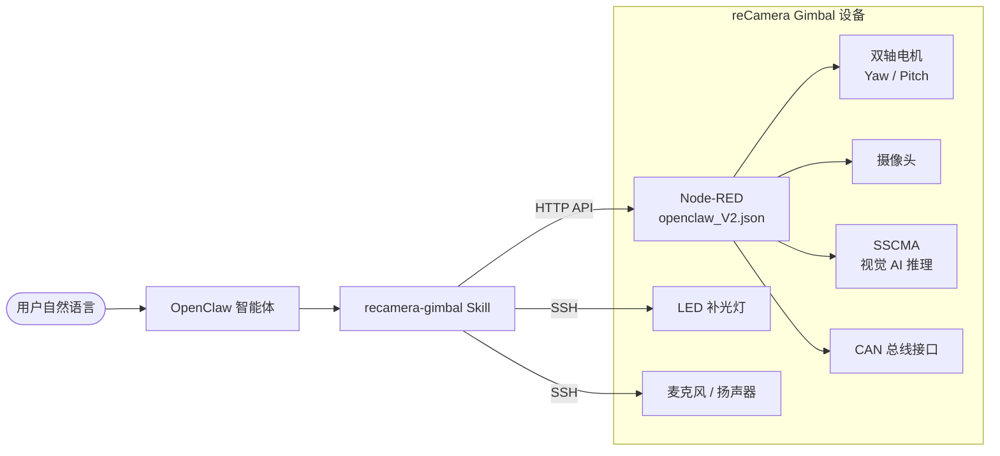

# reCamera Gimbal × OpenClaw

**简体中文** | [English](./README.md)

使用 **[OpenClaw](https://github.com/anthropics/openclaw)** 智能体控制 **reCamera Gimbal** 边缘 AI 相机——通过自然语言驱动云台转动、拍照识别、LED 补光、录音与播放。

[](./LICENSE)

> [!IMPORTANT]
> 本项目是 **OpenClaw** 生态的 Skill 扩展，不能独立运行。
>
> **前置条件：**
> - 已安装并运行 [OpenClaw](https://github.com/anthropics/openclaw)
> - reCamera Gimbal 硬件设备（基于 RISC-V 架构）
> - 设备已连入局域网，且 Node-RED 服务运行于 `:1880` 端口
> - 控制端需具备 SSH 访问权限（用于 LED、音频等硬件操作）
> - PowerShell（Windows）或 Bash（Linux/macOS）环境

## 工作原理



**数据流说明：**

1. 用户通过自然语言向 OpenClaw 发出指令（如"看看前面有什么"）
2. OpenClaw 匹配到 `recamera-gimbal` Skill，按 `SKILL.md` 中定义的操作指南执行
3. 云台控制和拍照通过 **HTTP API** 调用 Node-RED 流程完成
4. LED、录音、播放通过 **SSH** 直接操控设备硬件

## 功能特性

| 功能 | 说明 |
|------|------|
| **云台控制** | 双轴电机角度控制——Yaw (1°–345°)、Pitch (1°–175°) |
| **视觉感知** | 拍照后由多模态大模型进行图像分析与场景理解 |
| **目标追踪** | 基于 SSCMA 视觉 AI 的自动目标检测与云台跟踪 |
| **LED 补光** | 远程开关白色补光灯 |
| **录音** | 通过板载麦克风录制指定时长的音频 |
| **音频播放** | 通过板载扬声器播放录制的音频 |
| **CAN 总线** | 支持 CAN 协议通信（波特率 1000000，接口 can0） |
| **Web 仪表盘** | Node-RED Dashboard UI，含实时预览、手动控制、设备信息等页面 |

## 快速开始

### 1. 导入 Node-RED 流程

将 `openclaw_V2.json` 导入到 reCamera Gimbal 设备上运行的 Node-RED 实例中：

1. 打开 `http://<设备IP>:1880`
2. 点击右上角菜单 → **Import** → 粘贴或上传 `openclaw_V2.json`
3. 点击 **Deploy**

导入后 Node-RED 将提供以下依赖模块（需确保已安装）：

| npm 模块 | 版本 | 用途 |
|----------|------|------|
| `@flowfuse/node-red-dashboard` | v1.26.0 | Web 仪表盘 UI |
| `node-red-contrib-seeed-canbus` | v0.0.7 | CAN 总线通信 |
| `node-red-contrib-sscma` | v0.3.5 | SSCMA 视觉 AI 推理 |
| `node-red-contrib-os` | v0.2.1 | 系统信息采集 |
| `node-red-contrib-seeed-recamera` | v0.0.8 | reCamera 电机控制 |

### 2. 安装 Skill

将 `recamera-gimbal/` 目录复制到 OpenClaw 的 Skills 目录中：

```bash
cp -r recamera-gimbal/ <OpenClaw工作目录>/skills/recamera-gimbal
```

<!-- TODO: 待确认 OpenClaw 是否支持 CLI 安装 Skill 的命令 -->

### 3. 修改设备 IP

项目中多处硬编码了默认 IP `192.168.31.198`，请替换为你的设备实际 IP 地址：

- `recamera-gimbal/SKILL.md` — Skill 操作指南中的 API 地址
- `recamera-gimbal/scripts/*.ps1` — 各控制脚本中的 `$RecameraIp` 变量
- `recamera-gimbal/scripts/control_led.sh` — Bash 版 LED 控制脚本

### 4. 验证连接

```bash
# 测试 HTTP API —— 控制云台转到 yaw=180, pitch=90
curl -s "http://<设备IP>:1880/api/gimbal?yaw=180&pitch=90"

# 测试拍照接口
curl -s "http://<设备IP>:1880/api/photo" -o test_photo.jpg
```

## API 参考

Node-RED 流程暴露了两个 HTTP 端点：

| 端点 | 方法 | 参数 | 说明 |
|------|------|------|------|
| `/api/gimbal` | GET | `yaw` (1-345), `pitch` (1-175) | 控制云台双轴角度 |
| `/api/photo` | GET | — | 获取当前摄像头画面（JPEG） |

## Skill 配置

`recamera-gimbal/SKILL.md` 使用 [AgentSkills 规范](https://agentskills.io/specification#allowed-tools-field) 编写，核心字段：

| 字段 | 值 | 说明 |
|------|------|------|
| `name` | `recamera-gimbal` | Skill 标识名 |
| `version` | `1.2` | 当前版本 |
| `author` | `seeed` | 作者 |
| `allowed-tools` | `Exec` | 仅允许执行系统命令 |

Skill 当前的操作描述语言为中文，但 OpenClaw 可使用任何语言与之交互。如需自定义 Skill，请参阅 [AgentSkills 编写规范](https://agentskills.io/specification#allowed-tools-field)。

## 控制脚本

`recamera-gimbal/scripts/` 目录包含设备控制脚本，通过 SSH 执行：

| 脚本 | 功能 | 用法 |
|------|------|------|
| `control_led.ps1` | LED 开关 | `-Action on` / `-Action off` |
| `control_led.sh` | LED 开关（Bash 版） | `on` / `off` |
| `capture_photo.ps1` | 拍照保存到本地 | 无参数 |
| `record_audio.ps1` | 录音 | `-Duration <秒数>`（默认 5 秒） |
| `play_audio.ps1` | 播放录音 | 无参数 |

> **注意：** 脚本中包含硬编码的 SSH 凭据（默认用户 `recamera`），部署前请根据实际情况修改。

## Node-RED Dashboard

导入 `openclaw_V2.json` 后，Dashboard 可通过 `http://<设备IP>:1880/dashboard` 访问，包含以下页面：

| 页面 | 功能 |
|------|------|
| Gimbal_Preview | 实时画面预览 + 手动云台控制 |
| Security | 安全相关设置 |
| Network | 网络状态信息 |
| Terminal | 终端操作界面 |
| Device Info | 设备系统信息 |

## 故障排查

| 症状 | 检查项 |
|------|--------|
| 云台无响应 | 1. 确认设备 IP 可达 (`ping <设备IP>`) <br> 2. 确认 Node-RED 运行中 (`curl http://<设备IP>:1880`) <br> 3. 检查电机控制模块是否已安装 (`node-red-contrib-seeed-recamera`) |
| 拍照返回空 | 1. 访问 Dashboard 确认摄像头画面正常 <br> 2. 检查 `/api/photo` 端点是否 Deploy 成功 |
| LED 无法控制 | 1. 测试 SSH 连接：`ssh recamera@<设备IP>` <br> 2. 确认 `/sys/class/leds/white/brightness` 路径存在 |
| 录音/播放失败 | 1. 确认 SSH 连接正常且 sudo 权限可用 <br> 2. 检查音频设备：`arecord -l` / `aplay -l` |
| SSCMA 追踪不工作 | 1. 确认 MQTT 服务运行于 `localhost:1883` <br> 2. 检查 `node-red-contrib-sscma` 模块版本 |

## 相关链接

- [OpenClaw][openclaw] — AI 智能体平台
- [AgentSkills 规范][agentskills] — Skill 编写指南
- [reCamera][recamera] — reCamera 产品系列
- [Node-RED][nodered] — 流程编排引擎
- [SSCMA][sscma] — Seeed Studio 视觉 AI 框架

[openclaw]: https://github.com/anthropics/openclaw
[agentskills]: https://agentskills.io/specification#allowed-tools-field
[recamera]: https://www.seeedstudio.com/recamera
[nodered]: https://nodered.org/
[sscma]: https://github.com/Seeed-Studio/SSCMA

